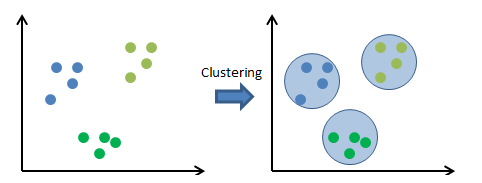

# Cluster Analysis

  
  |  |
  |:--:|
  | Clustering [^1] |

  
This study is to practice the Unsupervised Learning section (Chapter 7) of [Practical Statistics for Data Scientists](https://www.oreilly.com/library/view/practical-statistics-for/9781492072935/) book. We'll give some information about $k$-Means Clustering, Hierarchical Clustering and Model-Based Clustering using Python on Jupyter Notebook.

Clustering methods can be used to identify meaningful groups of data. For example, using the web clicks and demographic data of a user on a website, we may be able to group together different types of users [^2].

## $k$-Means Clustering
$k$-Means Clustering is an algorithm that groups data points into 'K' distinct clusters based on their similarity in order to discover patterns or structure in the data. In this method, the goal is to partition a dataset into 'K' clusters, where 'K' is a predefined number specified by the user. The algorithm iteratively assigns each data point to the cluster with the closest centroid (mean) and updates the centroids based on the new assignments.

[^1]: [Clustering Analysis](https://rpubs.com/ranvirkumarsah/Intro2Clustering)

[^2]: [Practical Statistics for Data Scientists](https://www.oreilly.com/library/view/practical-statistics-for/9781492072935/)

